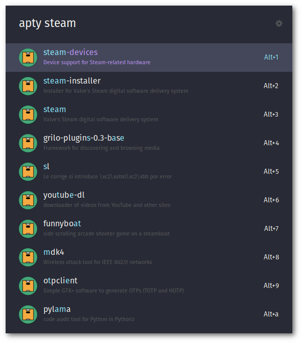

  

<h1 align="center">APTy</h1>

----------

This is an extension for [ULauncher](https://ulauncher.io/), it helps you to search and install your APT package!

| |
|-----------------------------|

## Options

Type `apty` and start seach the package, when you select one you can press enter and your terminal
will appear to install it!

If you do Alt-Enter you will copy the package name to your clipboard.

## Terminal apps commands

APTy needs a terminal configured to start the instalation, some examples:

| Name           | Command           |
|----------------|-------------------|
| Gnome terminal | gnome-terminal -- |
| Alacritty      | alacritty -e      |

----------

If you like my work you can

